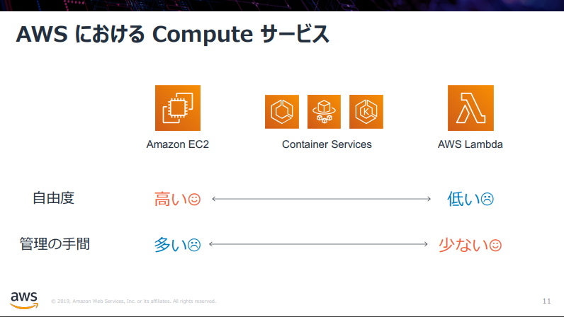
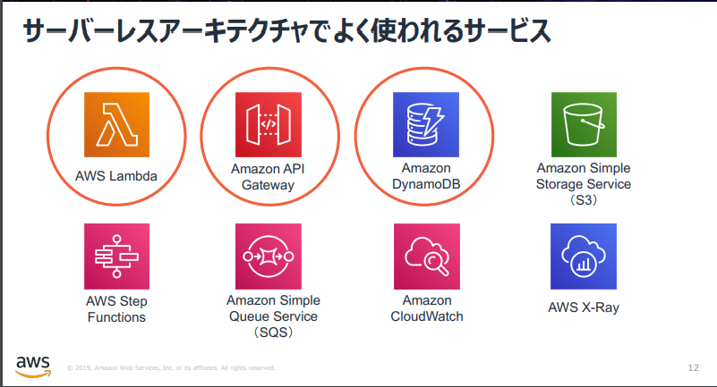

# 1.Serverless アーキテクチャの概要

## Agenda

1. [【★】Serverless アーキテクチャの概要](./01_serverless.md)
2. [AWS Lambda の紹介とハンズオン](./02_lambda.md)
   1. AWS Lambda の概要
   2. AWS Lambda ハンズオン① Lambda を単体で使ってみる
   3. AWS Lambda ハンズオン② 他のサービスを呼び出してみる（実施しません）
3. [Amazon API Gateway の紹介とハンズオン](./03_apigateway.md)
   1. Amazon API Gateway の概要
   2. Amazon API Gateway ハンズオン① API Gateway を単体で使ってみる
   3. Amazon API Gateway ハンズオン② API Gateway と Lambda を組み合わせる
4. [Amazon DynamoDB の紹介とハンズオン（実施しません）](./10_dynamodb.md)
   1. Amazon DynamoDB の概要（実施しません）
5. [Amazon RDS の紹介とハンズオン](./04_rds.md)
   1. Amazon RDSの概要
   2. Amazon RDS ハンズオン① RDSを単体で使ってみる
   3. Amazon RDS ハンズオン② API Gateway と Lambda と RDS を組み合わせる
6. [終わりに](./99_end.md)

### なぜサーバレスアーキテクチャなのか？

開発者は何をしたいのか？
→エンドユーザに価値を届ける

ビジネスには繋がらない（エンドユーザには見えない）が、必要な作業がある。

* サーバのセットアップ
* ミドルウェアランタイムのセットアップ
* セキュリティパッチの適用
* 耐障害性を確保するためのアーキテクチャ検討

サーバレスアーキテクチャは、これらの作業を**マネージドサービスに任せる**という特徴がある。

サーバレスアーキテクチャの主な特徴

* インフラのプロビジョニングや管理が不要
* 自動でスケール[^1]
* 高い可用性[^1]
* 価値に対する支払い[^2]

### AWSにおけるComputeサービス

大きく分けると3種類

* EC2
* Container
* Lambda

優劣があるわけではなく、適材適所、ないしは開発・運用する人のスキルセットに応じて、使い分けることが重要。

* 自由度
* 管理の手間

### サーバレスアーキテクチャでよく使われるAWSのサービス

computeサービス以外にも、よく使用されるサービスがある。

## Next

[AWS Lambda の紹介とハンズオン ＞](./02_lambda.md)

[^1]: オンプレやEC2だと、どのような条件でスケールするのかを検討・設計する必要があるが、サーバレスのサービスでその一部を担保出来る。
[^2]: オンプレの場合はサーバを起動しているだけで費用がかかるが、サーバレスならリクエスト毎に課金。

