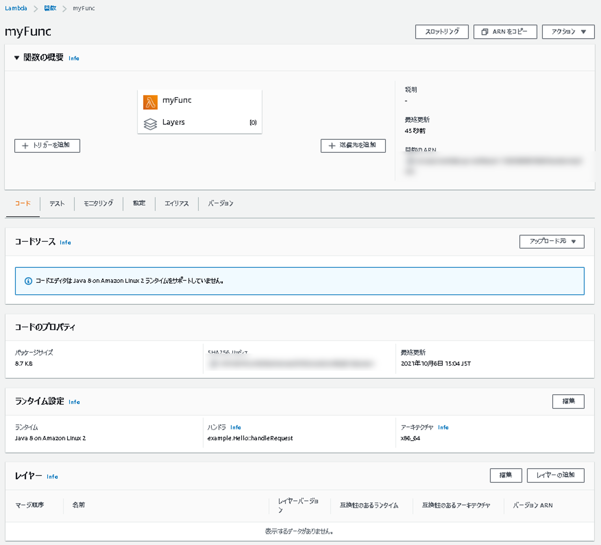

# 2.AWS Lambda の紹介とハンズオン

## Agenda

1. [Serverless アーキテクチャの概要](./01_serverless.md)
2. [【★】AWS Lambda の紹介とハンズオン](./02_lambda.md)
   1. AWS Lambda の概要
   2. AWS Lambda ハンズオン① Lambda を単体で使ってみる
   3. AWS Lambda ハンズオン② 他のサービスを呼び出してみる（実施しません）
3. [Amazon API Gateway の紹介とハンズオン](./03_apigateway.md)
   1. Amazon API Gateway の概要
   2. Amazon API Gateway ハンズオン① API Gateway を単体で使ってみる
   3. Amazon API Gateway ハンズオン② API Gateway と Lambda を組み合わせる
4. [Amazon DynamoDB の紹介とハンズオン（実施しません）](./10_dynamodb.md)
   1. Amazon DynamoDB の概要（実施しません）
5. [Amazon RDS の紹介とハンズオン](./04_rds.md)
   1. Amazon RDSの概要
   2. Amazon RDS ハンズオン① RDSを単体で使ってみる
   3. Amazon RDS ハンズオン② API Gateway と Lambda と RDS を組み合わせる
6. [終わりに](./99_end.md)

## AWS Lambda の概要

### AWS Lambda の特徴

> * サーバーのプロビジョニング/管理なしでプログラムを実⾏できるサービス 
> * コードの実⾏やスケーリングに必要なことは、Lambda 側で実施するので、 開発者の⽅はコードを書くことにより集中できる
> * リクエストベースの料⾦体系
>   * 実行回数＋実行時間
>     * それぞれ無料枠有り

### AWS Lambda におけるコーディングイメージ

* 対応言語
  * Java、Go、PowerShell、Node.js、C#、Python、Ruby
  * サポートされていない言語は、カスタムランタイムを実装することで利用可能

### AWS Lambda で設定できる項⽬ 

* 確保するメモリの量
  * 128MB 〜 3,008MB （64MBごと）
  * CPU 能⼒は確保するメモリの量に⽐例
* タイムアウト値
  * 最⼤で 900秒
* 実⾏ IAM ロール

### Lambdaのイベントソースと呼び出しタイプ

* 非同期呼び出し
  * 「Lambdaへのリクエストが正常に受け付けられたかどうかのみ」を返却
* 同期呼び出し
  * Lambdaの実行完了時にレスポンスを返却

### Lambda Functionのライフサイクル

* Lambdaは呼び出されると、コンテナ上でプログラムが実行する
* 1つのコンテナで同時に実行できるのは、1つのリクエストまで
* コンテナは再利用されるが、利用可能なコンテナが無い時はコールドスタート

## AWS Lambda ハンズオン① Lambda を単体で使ってみる

1. Lambdaを検索

   

2. 「関数の作成」を選択

3. 「関数の作成」

   1. 関数名：任意（myFunc）
   2. ランタイム：Java8 on Amazon Linux 1
   3. アクセス権限：デフォルト

   

4. 作成後

   
   
5. jarのアップロード

   [ソースコード](./1_lambda-hands-on/)

   1. ソースコードを任意の箇所にダウンロード

   2. ダウンロードしたディレクトリに移動して、`./gradlew build`

      1. Windows（コマンドプロンプト）の場合は「`.\gradlew.bat build`」

         ※すでにファイルがある場合は、上書きされない可能性があるので、削除してから行う

   3. `build/libs/HandsOn-1.0-SNAPSHOT.jar`が出力される

   4. 出力されたjarファイルを使用する

   

6. メソッドの指定

   * ランタイム：Java 8 on Amazon Linux 1
   * ハンドラ：`org.example.LambdaHandler::handleRequest`

   

   

7. テスト実行

   

   

## Next

[＜ Serverless アーキテクチャの概要](./01_serverless.md)

[Amazon API Gateway の紹介とハンズオン ＞](./03_apigateway.md)

