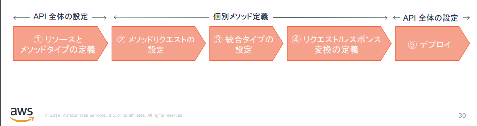

# 3.Amazon API Gateway の紹介とハンズオン

## Agenda

1. [Serverless アーキテクチャの概要](./01_serverless.md)
2. [AWS Lambda の紹介とハンズオン](./02_lambda.md)
   1. AWS Lambda の概要
   2. AWS Lambda ハンズオン① Lambda を単体で使ってみる
   3. AWS Lambda ハンズオン② 他のサービスを呼び出してみる（実施しません）
3. [【★】Amazon API Gateway の紹介とハンズオン](./03_apigateway.md)
   1. Amazon API Gateway の概要
   2. Amazon API Gateway ハンズオン① API Gateway を単体で使ってみる
   3. Amazon API Gateway ハンズオン② API Gateway と Lambda を組み合わせる
4. [Amazon DynamoDB の紹介とハンズオン（実施しません）](./10_dynamodb.md)
   1. Amazon DynamoDB の概要（実施しません）
5. [Amazon RDS の紹介とハンズオン](./04_rds.md)
   1. Amazon RDSの概要
   2. Amazon RDS ハンズオン① RDSを単体で使ってみる
   3. Amazon RDS ハンズオン② API Gateway と Lambda と RDS を組み合わせる
6. [終わりに](./99_end.md)


## azon API Gateway の概要

### API Gatewayの特徴

> * サーバをプロビジョニング／管理することなく、APIの作成・管理出来るマネージドサービス。
> * 可用性の担保やスケーラビリティの確保、APIキーの管理と言った作業を、API Gatewayに任せる事ができ、開発者はAPIの開発に注力することが可能。
> * 「REST API」と「WebSocket」に対応
>   * 本ハンズオンでは「REST API」を使用
>   * リクエストベースの料金体系
>     * 実行回数（＋キャッシュメモリ量）＋データ転送量


### API Gatewayの使い方（REST APIの場合）

大きく5つのフェーズに分かれる。

1. リソースとメソッドタイプの定義
2. メソッドリクエストの設定
   * 認証の設定、クエリパラメータ、HTTPヘッダの設定など
3. 統合タイプの設定
   * バックエンドの種別を選択する
     * Lambda、HTTP、Mock、AWSサービス、VPCリンク
4. リクエスト／レスポンス変換の定義
   * バックエンドへのInput、バックエンドからのOutputを変換することが可能
   * 「プロキシ統合」を使用すると、変換せずに返すことが可能
5. デプロイ




## Amazon API Gateway ハンズオン① API Gateway を単体で使ってみる

### Mockデータを返すAPIを作成する

1. API Gatewayを検索

2. 「APIを作成」を選択

3. APIの作成

   1. プロトコル：REST
   2. 新しいAPIの作成：新しいAPI
   3. 名前と説明
      1. API名：mock-api
      2. 説明：空欄
      3. エンドポイントタイプ：リージョン

4. 「アクション」→「リソースの作成」を選択

   1. リソース名：sample

5. 作成した「sample」を選択した状態で、「アクション」→「メソッドの作成」を選択

   1. プルダウン：GET
   2. チェックボタンを押下

6. セットアップ

   1. 統合タイプ：Mock

7. 統合レスポンスを選択

   1. マッピングテンプレート：`application/json`

   2. json内容

      ```json
      {
          "statusCode":200,
          "body":"hoge"
      }
      ```

8. 「メソッドの実行」→「テスト」→「テスト」を実行

9. デプロイ

   1. 「アクション」→「APIのデプロイ」
      1. デプロイされるステージ：新しいステージ
      2. ステージ名：dev

10. 「ステージ」→「dev」→「URLの呼び出し」を選択


## Amazon API Gateway ハンズオン② API Gateway と Lambda を組み合わせる

### 入力した文字列の末尾に「`-nyan`」とつけるAPIを作成する:cat:

※「この程度ならLambdaいらないじゃん」とか言わないで・・・

[ソースコード](./2_apigateway-hands-on/)

* 依存ライブラリ（`Gson`）もjarに含めるため（`fat jar`作成のため）に、`Gradle Shadow Plugin`を使用しています。

  * `./gradlew shadowJar`を実行することで、`fat jar`が作成されます。

    ※Windowsの場合は、同様に`.\gradlew.bat shadowJar`を実行してください

1. Lambdaを検索
2. 先程作成した「myFunc」を使用する
3. jarのアップロード
   1. 上記で作成した`fat jar`を指定する
4. テスト
   1. 新しいイベント
   2. テンプレート：`apigateway-aws-proxy`
   3. 名前：test-api
   4. 変更を保存→テスト


### API Gatewayの設定

1. API Gatewayを検索

2. 「APIを作成」を選択

3. APIの作成

   1. プロトコル：REST
   2. 新しいAPIの作成：新しいAPI
   3. 名前と説明
      1. API名：test-api
      2. 説明：空欄
      3. エンドポイントタイプ：リージョン

4. 「アクション」→「リソースの作成」を選択

   1. リソース名：test

5. 作成した「test」を選択した状態で、「アクション」→「メソッドの作成」を選択

   1. プルダウン：GET
   2. チェックボタンを押下

6. セットアップ

   1. 統合タイプ：Lambda 関数
   2. Lambda プロキシ統合の使用：チェックを入れる
   3. Lambda関数：myFunc
   4. Lambda関数に権限を追加する：OK

7. メソッドリクエストを選択

   1. URLクエリ文字列パラメータ

      1. 名前：`input_text`

      2. 必須：チェックを入れる

         ※一度作成しないとチェックを行えない

8. 「メソッドの実行」→「テスト」→「テスト」を実行

   1. クエリ文字列

      `input_text=hoge`

9. デプロイ

   1. 「アクション」→「APIのデプロイ」
      1. デプロイされるステージ：dev

10. 「ステージ」→「dev」→「URLの呼び出し」を選択

    1. URLの末尾に`/test?input_text=bar`を追加


## Next

[＜ AWS Lambda の紹介とハンズオン](./02_lambda.md)

[Amazon RDS の紹介とハンズオン ＞](./04_rds.md)

