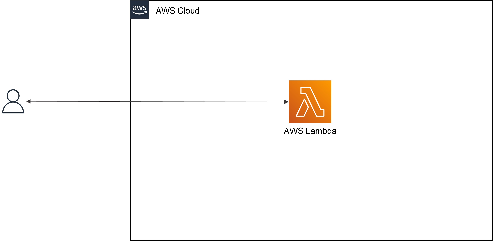
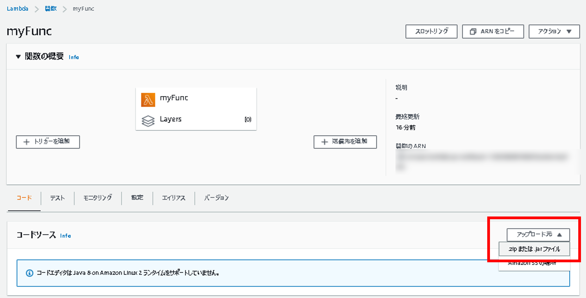

# AWS Lambda ハンズオン① Lambda を単体で使ってみる

## Agenda

1. [Serverless アーキテクチャの概要](./01_serverless.md)
2. AWS Lambda の紹介とハンズオン
   1. [AWS Lambda の概要](./10_lambda.md)
   2. [AWS Lambda ハンズオン① Lambda を単体で使ってみる](./11_lambda_1.md)
   3. AWS Lambda ハンズオン② 他のサービスを呼び出してみる（実施しません）
3. Amazon API Gateway の紹介とハンズオン
   1. [Amazon API Gateway の概要](./20_apigateway.md)
   2. [Amazon API Gateway ハンズオン① API Gateway を単体で使ってみる](./21_apigateway_1.md)
   3. [Amazon API Gateway ハンズオン② API Gateway と Lambda を組み合わせる](./22_apigateway_2.md)
4. Amazon DynamoDB の紹介とハンズオン（実施しません）
   1. [Amazon DynamoDB の概要（実施しません）](./30_dynamodb.md)
5. Amazon RDS の紹介とハンズオン
   1. [Amazon RDSの概要](./40_rds.md)
   2. [Amazon RDS ハンズオン① RDSを単体で使ってみる](./41_rds_1.md)
   3. [Amazon RDS ハンズオン② API Gateway と Lambda と RDS を組み合わせる](./42_rds_2.md)
6. [終わりに](./99_end.md)


### 概要

* Inputで渡した値を含んだ、Jsonを返すLambdaを作成

  ※詳細は、ソースコードをご確認ください

  * Input

  ```json
  {
    "key1": "value1",
    "key2": "value2",
    "key3": "value3"
  }
  ```

  * Output

  ```json
  {
    "input": {
      "key1": "value1",
      "key2": "value2",
      "key3": "value3"
    },
    "context": {
      "awsRequestId": "xxx",
      "logGroupName": "/aws/lambda/myFunc",
      "logStreamName": "YYYY/MM/DD/xxx",
      "functionName": "myFunc",
      "functionVersion": "$LATEST",
      "invokedFunctionArn": "arn:aws:lambda:ap-northeast-1:xxx:function:myFunc",
      "logger": {},
      "remainingTimeInMillis": 15000,
      "memoryLimitInMB": 512
    },
    "body": "test",
    "statusCode": "200"
  }
  ```




### 手順

1. Lambdaを検索

   

2. 「関数の作成」を選択

3. 「関数の作成」

   1. オプション：「一から作成」

   2. 関数名：任意（myFunc）

   3. ランタイム：Java8 on Amazon Linux 2

      Q：Amazon Linux1と2の違いは？

      A：2は、EC2上のパフォーマンスが最適化されるように、カーネルが調整されています。

      　　1は、2020年12月31日でEOL（End of Life）となっているので、基本的には「2」を使いましょう。

   4. アーキテクチャ：x86_64

   5. アクセス権限：デフォルト

   

4. 作成後

   
   
5. jarのアップロード

   1. jarの準備（ローカルPCにて実施）

      1. ダウンロードした`aws_handson/01_serverless-architecture/1_lambda-hands-on/`にディレクトリに移動

      2. `./gradlew build`を実行

         1. Windows（コマンドプロンプト）の場合は「`.\gradlew.bat build`」

            ※すでにファイルがある場合は、上書きされない可能性があるので、削除してから行う

      3. `build/libs/HandsOn-1.0-SNAPSHOT.jar`が出力される

   2. 出力されたjarファイルを使用する（AWSマネジメントコンソールにて実施）

      1. 「コードタブ」＞「アップロード元」＞「zip または jar ファイル」

         

      2. 「アップロード」を選択し、先程作成したjarファイルを指定し、保存

         

6. メソッドの指定

   1. 「コードタブ」＞「ランタイム設定」＞「編集」
      * ランタイム：Java 8 on Amazon Linux 2
      * ハンドラ：`org.example.LambdaHandler::handleRequest`
      * アーキテクチャ：`x86_64`

   

   

7. テスト実行

   1. 「テストタブ」＞「新しいイベント」

   

   


## Next

[＜ AWS Lambda の概要](./10_lambda.md)

[Amazon API Gateway の概要 ＞](./20_apigateway.md)

