# 3.Amazon API Gateway の紹介とハンズオン

## Agenda

1. [Serverless アーキテクチャの概要](./01_serverless.md)
2. AWS Lambda の紹介とハンズオン
   1. [AWS Lambda の概要](./10_lambda.md)
   2. [AWS Lambda ハンズオン① Lambda を単体で使ってみる](./11_lambda_1.md)
   3. AWS Lambda ハンズオン② 他のサービスを呼び出してみる（実施しません）
3. Amazon API Gateway の紹介とハンズオン
   1. [Amazon API Gateway の概要](./20_apigateway.md)
   2. [Amazon API Gateway ハンズオン① API Gateway を単体で使ってみる](./21_apigateway_1.md)
   3. [Amazon API Gateway ハンズオン② API Gateway と Lambda を組み合わせる](./22_apigateway_2.md)
4. Amazon DynamoDB の紹介とハンズオン（実施しません）
   1. [Amazon DynamoDB の概要（実施しません）](./30_dynamodb.md)
5. Amazon RDS の紹介とハンズオン
   1. [Amazon RDSの概要](./40_rds.md)
   2. [Amazon RDS ハンズオン① RDSを単体で使ってみる](./41_rds_1.md)
   3. [Amazon RDS ハンズオン② API Gateway と Lambda と RDS を組み合わせる](./42_rds_2.md)
6. [終わりに](./99_end.md)


## Amazon API Gateway ハンズオン① API Gateway を単体で使ってみる

### 概要

* Mockデータを返すAPIを作成する


### 手順

1. API Gatewayを検索

   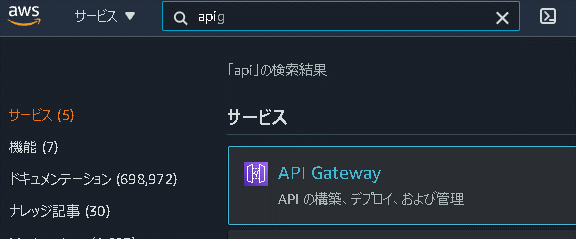

2. 「REST API」＞「構築」を選択

   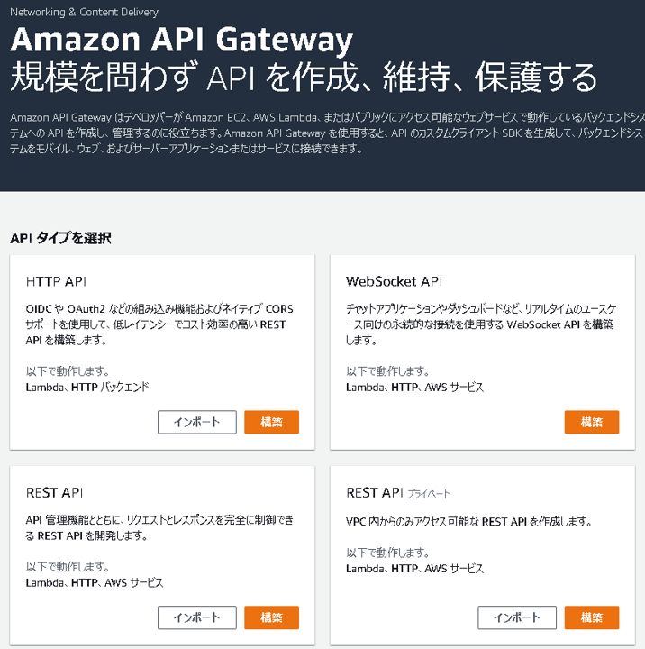

3. 「最初のAPIを作成する」ダイアログは「OK」

   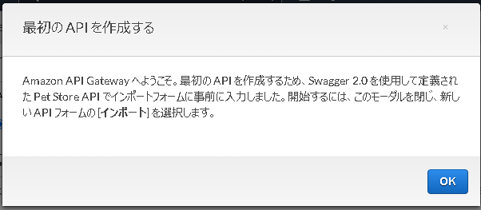

4. APIの作成

   1. プロトコル：REST
   2. 新しいAPIの作成：新しいAPI
   3. 名前と説明
      1. API名：mock-api
      2. 説明：空欄
      3. エンドポイントタイプ：リージョン

   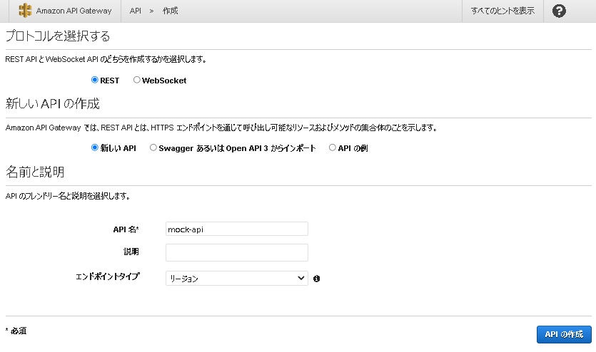

5. 「アクション」→「リソースの作成」を選択

   1. リソース名：sample

   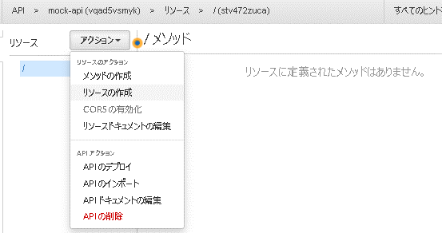

   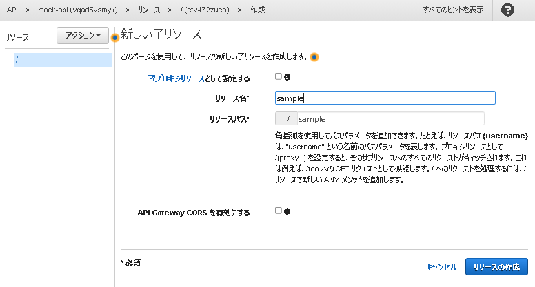

6. 作成した「sample」を選択した状態で、「アクション」→「メソッドの作成」を選択

   1. プルダウン：GET
   2. チェックボタンを押下

   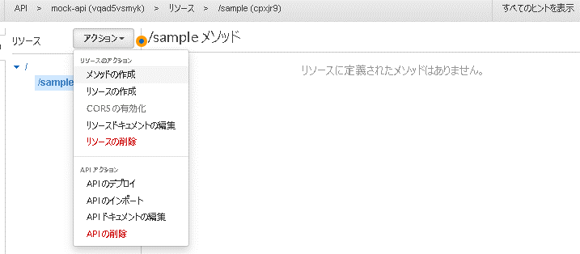

   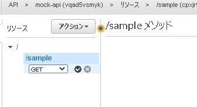

7. セットアップ

   1. 統合タイプ：Mock

   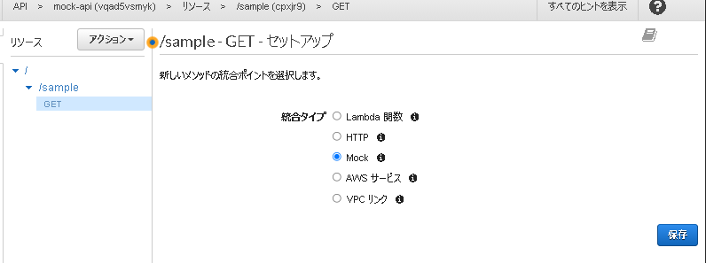

8. 統合レスポンスを選択

   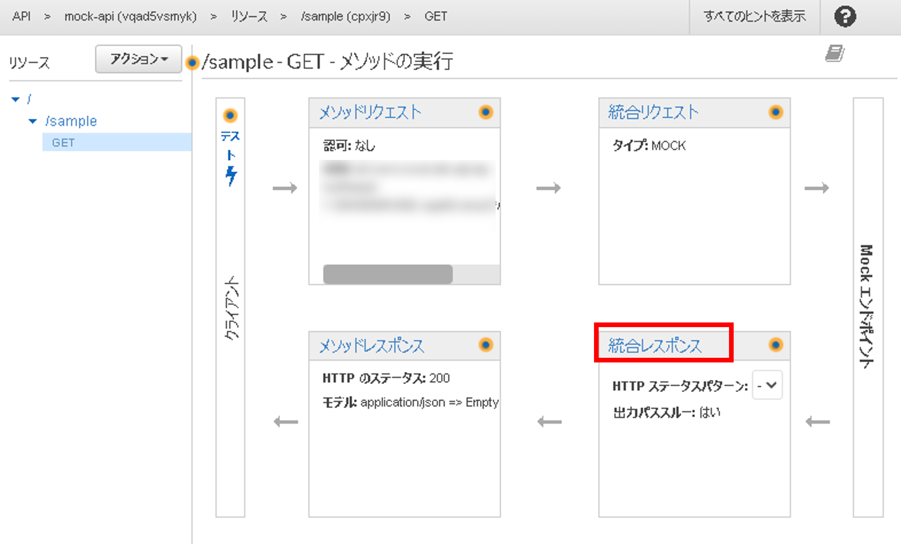

   1. マッピングテンプレート：`application/json`

   2. json内容

      ```json
      {
          "statusCode":200,
          "body":"hoge"
      }
      ```

   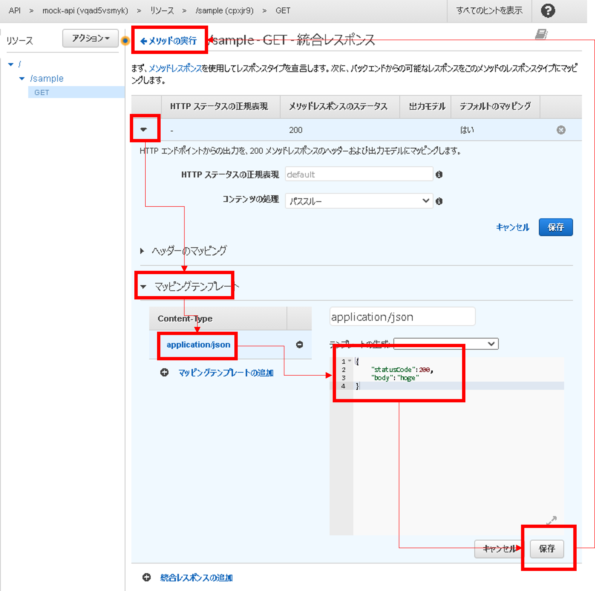

9. 「メソッドの実行」→「テスト」→「テスト」を実行

   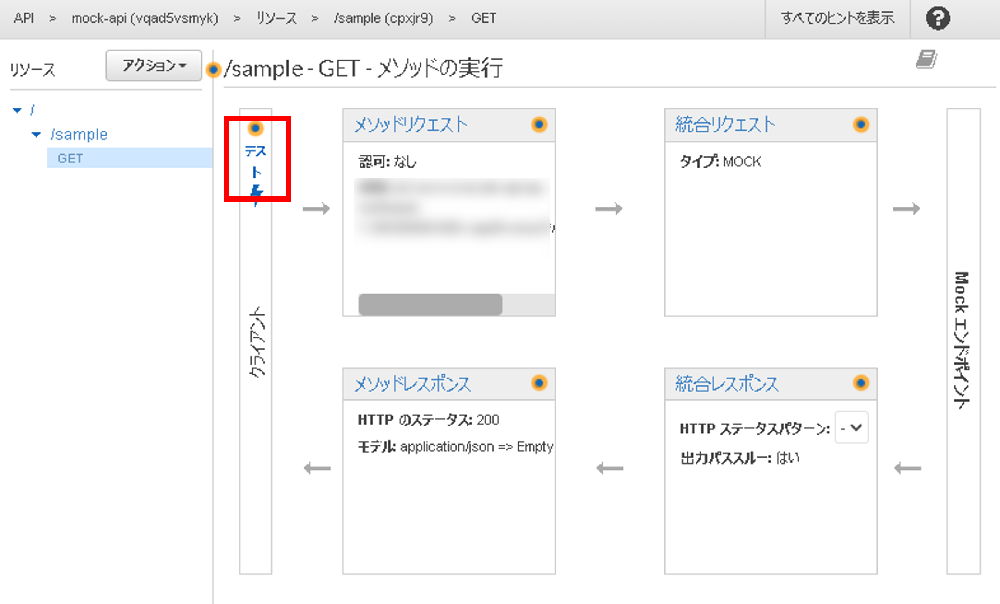

   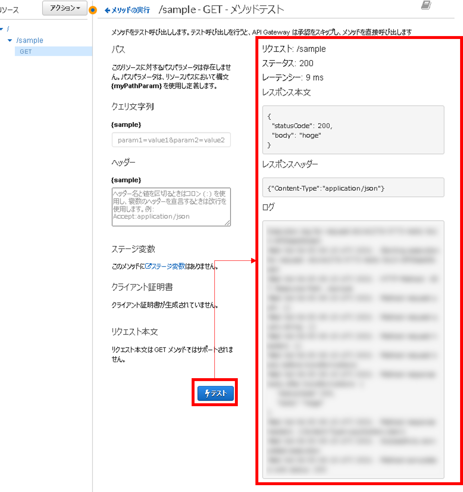

10. デプロイ

       1. 「アクション」→「APIのデプロイ」

          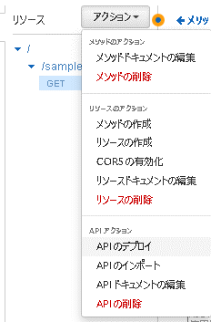

    2. デプロイされるステージ：新しいステージ

    3. ステージ名：dev

       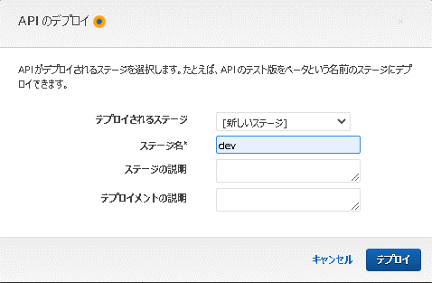

11. 「ステージ」→「dev」→「URLの呼び出し」を選択

    ※末尾に「`/sample`」をつける

    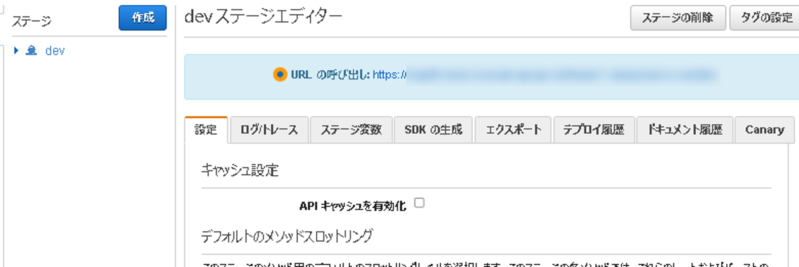

    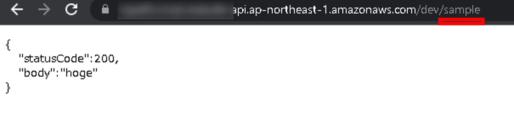

## Next

[＜ Amazon API Gateway の概要](./20_apigateway.md)

[Amazon API Gateway ハンズオン② API Gateway と Lambda を組み合わせる ＞](./22_apigateway_2.md)

