# Amazon API Gateway ハンズオン② API Gateway と Lambda を組み合わせる

## Agenda

1. [Serverless アーキテクチャの概要](./01_serverless.md)
2. AWS Lambda の紹介とハンズオン
   1. [AWS Lambda の概要](./10_lambda.md)
   2. [AWS Lambda ハンズオン① Lambda を単体で使ってみる](./11_lambda_1.md)
   3. AWS Lambda ハンズオン② 他のサービスを呼び出してみる（実施しません）
3. Amazon API Gateway の紹介とハンズオン
   1. [Amazon API Gateway の概要](./20_apigateway.md)
   2. [Amazon API Gateway ハンズオン① API Gateway を単体で使ってみる](./21_apigateway_1.md)
   3. [Amazon API Gateway ハンズオン② API Gateway と Lambda を組み合わせる](./22_apigateway_2.md)
4. Amazon DynamoDB の紹介とハンズオン（実施しません）
   1. [Amazon DynamoDB の概要（実施しません）](./30_dynamodb.md)
5. Amazon RDS の紹介とハンズオン
   1. [Amazon RDSの概要](./40_rds.md)
   2. [Amazon RDS ハンズオン① RDSを単体で使ってみる](./41_rds_1.md)
   3. [Amazon RDS ハンズオン② API Gateway と Lambda と RDS を組み合わせる](./42_rds_2.md)
6. [終わりに](./99_end.md)


### 概要

* 入力した文字列の末尾に「`-nyan`」とつけるAPIを作成する:cat:

※「この程度ならLambdaいらないじゃん」とか言わないで・・・


1. lambda用のjarを作成
2. API Gateway から、Lambdaを呼び出す


### 手順（Lambdaの設定）

1. jarの準備（ローカルPCにて実施）

   1. `aws_handson/01_serverless-architecture/2_apigateway-hands-on/`に移動

   2. `./gradlew shadowJar`を実行

      1. Windows（コマンドプロンプト）の場合は、「`.\gradlew.bat shadowJar`」

         ※依存ライブラリ（`Gson`）もjarに含めるため（`fat jar`作成のため）に、`Gradle Shadow Plugin`を使用しています。

2. 出力されたjarファイルを使用する（AWSマネジメントコンソールにて実施）

   1. 「コードタブ」＞「アップロード元」＞「zip または jar ファイル」

      

   2. 「アップロード」を選択し、先程作成したjarファイルを指定し、保存

      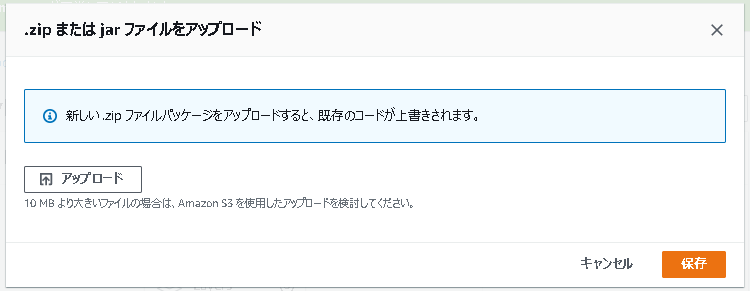

3. メソッドの指定

   1. 「コードタブ」＞「ランタイム設定」＞「編集」
      * ランタイム：Java 8 on Amazon Linux 2
      * ハンドラ：`org.example.handler.LambdaHandler::handleRequest`
      * アーキテクチャ：`x86_64`

   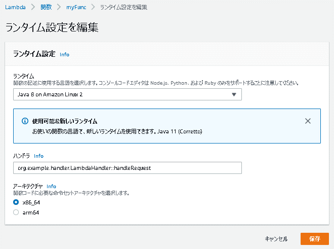

4. 「テストタブ」＞「新しいイベント」

   1. 新しいイベント

   2. テンプレート：`apigateway-aws-proxy`

      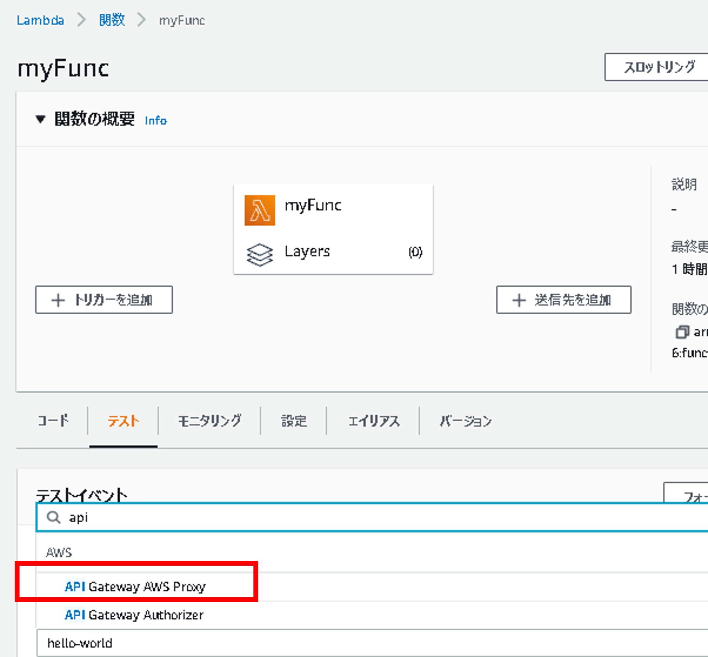

   3. 名前：test-api

   4. `queryStringParameters`を修正（7～9行目あたり）

      ※引数にて`input_text`として取得しているため

      ```diff
        "queryStringParameters": {
      -    "foo": "bar"
      +    "input_text": "bar"
        },
      ```

      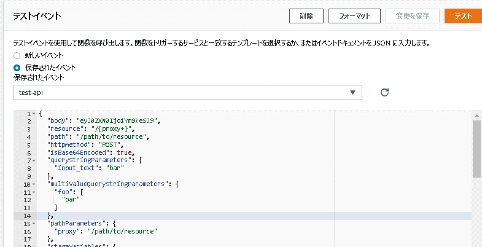

   5. 変更を保存→テスト

      


### 手順（API Gatewayの設定）

1. API Gatewayを検索

2. 「REST API」＞「構築」を選択

3. APIの作成

   1. プロトコル：REST
   2. 新しいAPIの作成：新しいAPI
   3. 名前と説明
      1. API名：test-api
      2. 説明：空欄
      3. エンドポイントタイプ：リージョン

4. 「アクション」→「リソースの作成」を選択

   1. リソース名：test

5. 作成した「test」を選択した状態で、「アクション」→「メソッドの作成」を選択

   1. プルダウン：GET
   2. チェックボタンを押下

6. セットアップ

   1. 統合タイプ：Lambda 関数

   2. Lambda プロキシ統合の使用：チェックを入れる

   3. Lambda関数：myFunc

      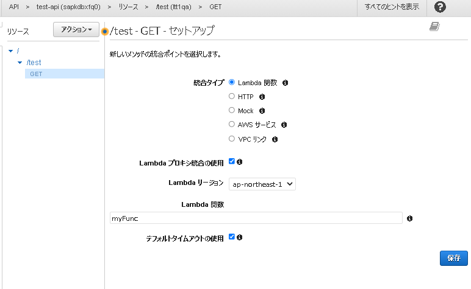

   4. Lambda関数に権限を追加する：OK

      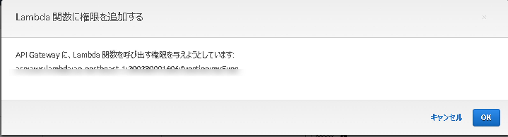

7. メソッドリクエストを選択

   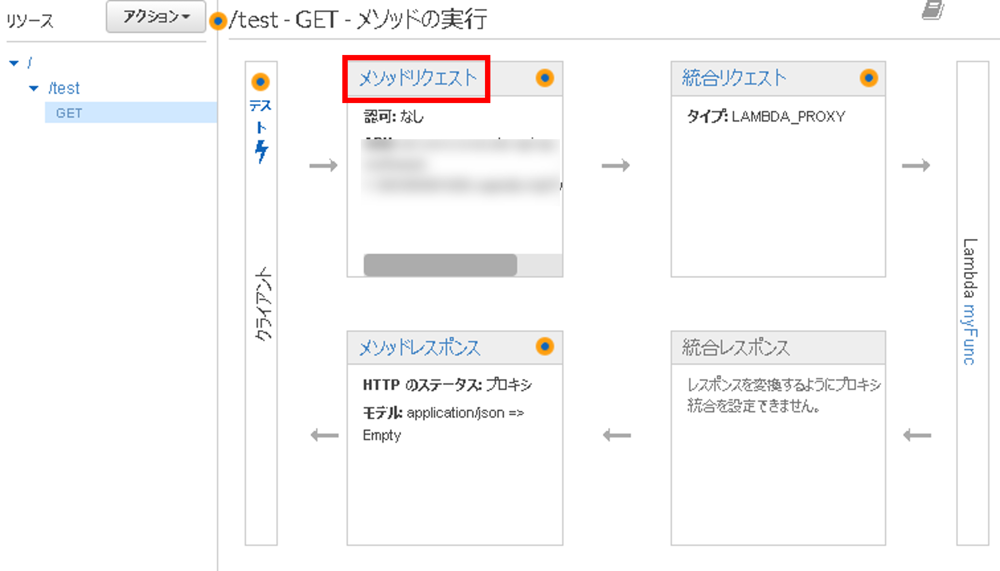

   1. URLクエリ文字列パラメータ

      1. 名前：`input_text`

         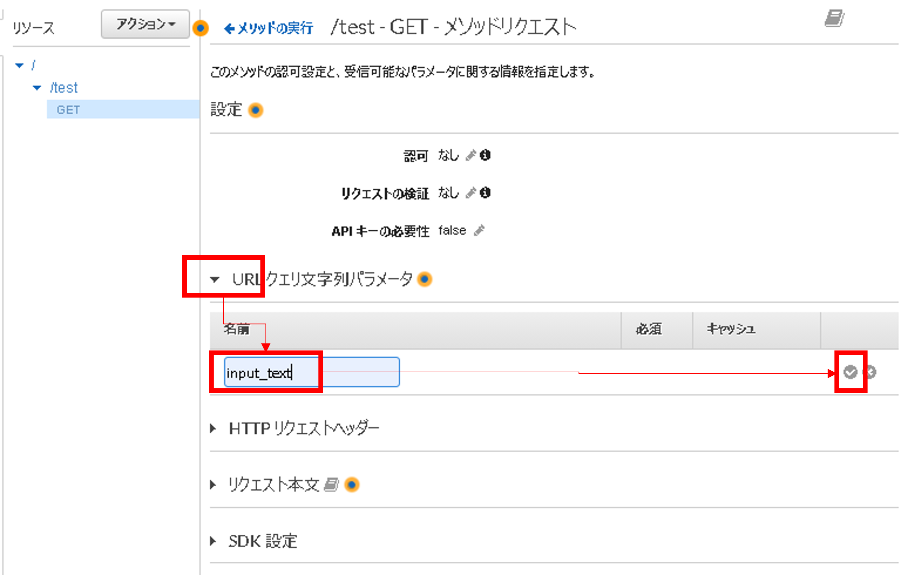

      2. 必須：チェックを入れる

         ※一度作成しないとチェックを行えない

         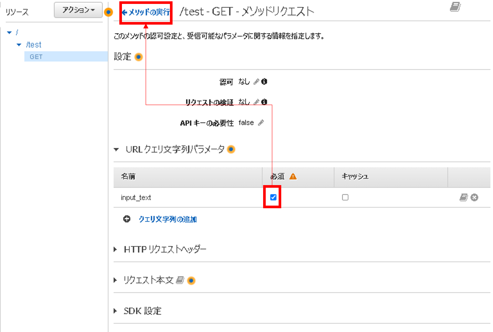

8. 「メソッドの実行」→「テスト」→「テスト」を実行

   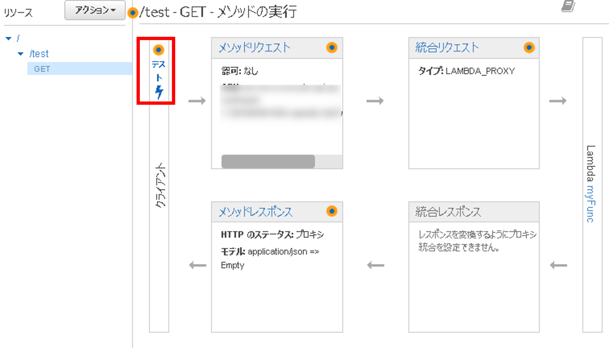

   1. クエリ文字列

      `input_text=hoge`

      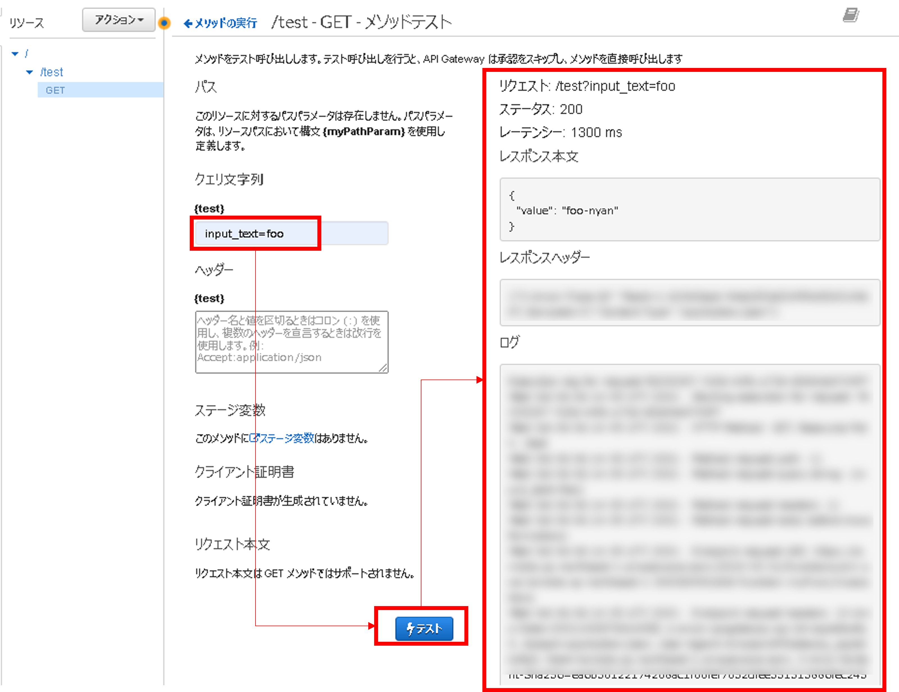

9. デプロイ

   1. 「アクション」→「APIのデプロイ」
      1. デプロイされるステージ：dev

10. 「ステージ」→「dev」→「URLの呼び出し」を選択

    1. URLの末尾に`/test?input_text=bar`を追加


## Next

[＜ Amazon API Gateway ハンズオン① API Gateway を単体で使ってみる](./21_apigateway_1.md)

[Amazon DynamoDB の概要（実施しません） ＞](./30_dynamodb.md)

