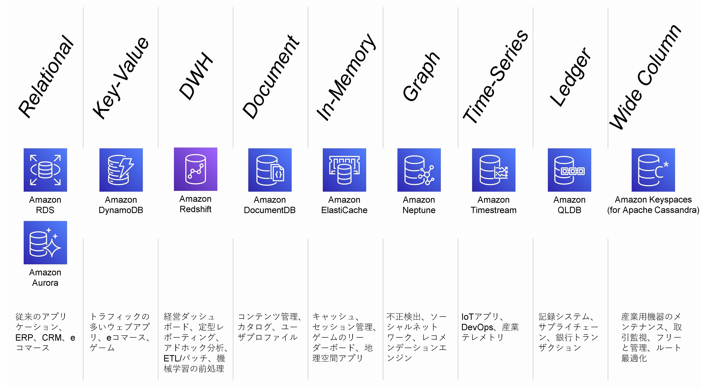

# Amazon RDSの概要

## Agenda

1. [Serverless アーキテクチャの概要](./01_serverless.md)
2. AWS Lambda の紹介とハンズオン
   1. [AWS Lambda の概要](./10_lambda.md)
   2. [AWS Lambda ハンズオン① Lambda を単体で使ってみる](./11_lambda_1.md)
   3. AWS Lambda ハンズオン② 他のサービスを呼び出してみる（実施しません）
3. Amazon API Gateway の紹介とハンズオン
   1. [Amazon API Gateway の概要](./20_apigateway.md)
   2. [Amazon API Gateway ハンズオン① API Gateway を単体で使ってみる](./21_apigateway_1.md)
   3. [Amazon API Gateway ハンズオン② API Gateway と Lambda を組み合わせる](./22_apigateway_2.md)
4. Amazon DynamoDB の紹介とハンズオン（実施しません）
   1. [Amazon DynamoDB の概要（実施しません）](./30_dynamodb.md)
5. Amazon RDS の紹介とハンズオン
   1. [Amazon RDSの概要](./40_rds.md)
   2. [Amazon RDS ハンズオン① RDSを単体で使ってみる](./41_rds_1.md)
   3. [Amazon RDS ハンズオン② API Gateway と Lambda と RDS を組み合わせる](./42_rds_2.md)
6. [終わりに](./99_end.md)

## AWSのデータベースサービス

※https://www2.slideshare.net/AmazonWebServicesJapan/20201216-aws-black-belt-online-seminar-amazon-timestream#7

## Amazon RDSの概要

※https://d1.awsstatic.com/webinars/jp/pdf/services/20180425_AWS-BlackBelt_RDS.pdf

> * フルマネージドなリレーショナルデータベース
> * シンプルかつ迅速にスケール可能
> * 高速、安定したパフォーマンス
> * 低コスト、従量課金
>   * 無料利用枠有り（DBエンジン毎に計算が異なるので割愛）
> * DBエンジン
>   * MySQL、ORACLE、SQL Server、PostgreSQL、Amazon Aurora

### 特徴

> * シンプルな構築
>   * 数クリックでDBが起動
>     * DBエンジン
>     * インスタンスクラス
>     * ディスク種類とサイズ・・・
>   * 選択するだけで高度な機能を実装可能
>     * マルチAZへのデプロイメント
>     * リードレプリカ
>     * バックアップ（スナップショット）
>     * 監視、拡張モニタリング・・・
> * 高い可用性
> * パフォーマンスの向上
> * 運用負荷の軽減
>   * 自動バックアップ（RDS標準機能）
>     * 自動スナップショット＋トランザクションログをS3に保存
>   * スナップショット
>     * 1日1回自動取得（バックアップウィンドウで指定）
>       * DBインスタンスのサイズと同サイズまでストレージコストが無料
>       * DBインスタンス削除と同時に削除
>     * 最大35日分保存（0～35日で設定可能）
>     * 手動スナップショットは任意の時間に実施可能
>   * リストア
>     * リストア：スナップショットを元にDBインスタンスを作成
>     * Point-in-Timeリカバリ：指定した時刻の状態になるようにDBインスタンスを作成
> * セキュリティ
>   * VPC対応
>     * 任意のサプネットで起動可能
>   * アクセス制御
>     * デフォルトではDBインスタンスに対するネットワークアクセスはオフ
>     * セキュリティグループによりアクセス制御
>   * DBインスタンスの暗号化
>     * 保管時のインスタンスとスナップショットの暗号化が可能
>       * 対応するインスタンスタイプがある
>       * DBエンジン毎に暗号化方式が異なる

### 制限事項（例）

> * バージョンが限定される
> * キャパシティに上限がある
> * OSログインやファイルシステムへのアクセスができない
> * IPアドレスの固定が行えない
> * 一部の機能が使えない
> * 個別パッチが適用できない

→トレードオフが許容できない場合は、`On EC2`かオンプレミスで構築する

## Next

[＜ Amazon DynamoDB の概要（実施しません）](./30_dynamodb.md)

[Amazon RDS ハンズオン① RDSを単体で使ってみる ＞](./41_rds_1.md)

