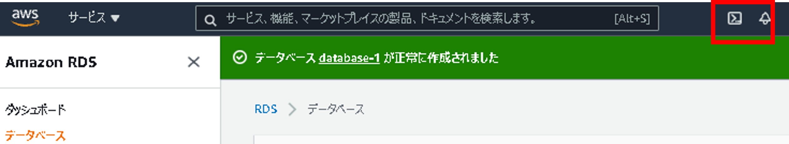
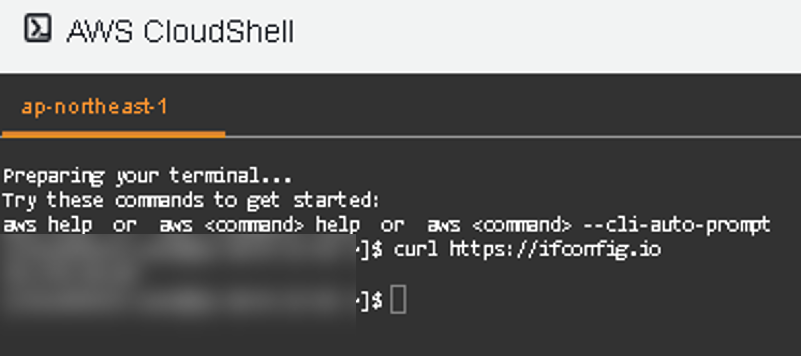
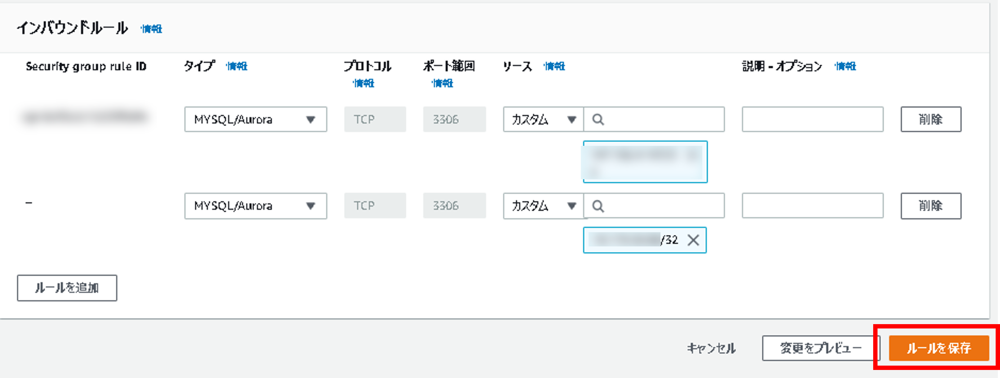

# Amazon RDS ハンズオン① RDSを単体で使ってみる

## Agenda

1. [Serverless アーキテクチャの概要](./01_serverless.md)
2. AWS Lambda の紹介とハンズオン
   1. [AWS Lambda の概要](./10_lambda.md)
   2. [AWS Lambda ハンズオン① Lambda を単体で使ってみる](./11_lambda_1.md)
   3. AWS Lambda ハンズオン② 他のサービスを呼び出してみる（実施しません）
3. Amazon API Gateway の紹介とハンズオン
   1. [Amazon API Gateway の概要](./20_apigateway.md)
   2. [Amazon API Gateway ハンズオン① API Gateway を単体で使ってみる](./21_apigateway_1.md)
   3. [Amazon API Gateway ハンズオン② API Gateway と Lambda を組み合わせる](./22_apigateway_2.md)
4. Amazon DynamoDB の紹介とハンズオン（実施しません）
   1. [Amazon DynamoDB の概要（実施しません）](./30_dynamodb.md)
5. Amazon RDS の紹介とハンズオン
   1. [Amazon RDSの概要](./40_rds.md)
   2. [Amazon RDS ハンズオン① RDSを単体で使ってみる](./41_rds_1.md)
   3. [Amazon RDS ハンズオン② API Gateway と Lambda と RDS を組み合わせる](./42_rds_2.md)
6. [終わりに](./99_end.md)


## 概要

* RDS for MySQLを構築し、CloudShellでアクセスする

※https://kacfg.com/cloudshell/#RDS


## 手順

1. RDSを検索

   

2. 「データベースの作成」を選択

   

3. データベースの作成（設定する箇所は`★`を記載）

   1. データベース作成方法の選択

      1. データベース作成方法：標準作成

   2. エンジンのオプション

      1. ★エンジンのタイプ：`MySQL`
      2. バージョン：`MySQL 8.0.23`

      

   3. テンプレート

      1. ★テンプレート：**無料利用枠**

   4. 設定

      1. DBインスタンス識別子：`database-1`（任意）

      2. マスターユーザ名：`admin`（任意）

      3. ★マスターパスワード：任意の文字列

         ※8文字以上。スラッシュ、シングルクォート、ダブルクォート、アットマークは使用不可能

      4. ★パスワードを確認：任意の文字列

      

   5. DBインスタンスクラス

      1. DBインスタンスクラス：`db.t2.micro`（無料利用枠なので、そのまま）

   6. ストレージ

      1. ストレージタイプ：汎用SSD（gp2）
      2. ストレージ割当：20
      3. ★ストレージの自動スケーリングを有効にする：チェックを外す

      

   7. 接続

      1. VPC：デフォルト
      2. サブネットグループ：デフォルト
      3. ★パブリックアクセス：あり
      4. ★VPCセキュリティグループ：新規作成
      5. ★新しいVPCセキュリティグループ名：`rds_sg`
      6. ★アベイラビリティゾーン：`ap-northeast-1a`

      

   8. データベース認証

      1. データベース認証オプション：パスワード認証

      

   9. 追加設定

      1. データベースの選択肢
         1. ★最初のデータベース名：`rds_test`
         2. DBパラメータグループ：`default:mysql8.0`
         3. オプショングループ：`default:mysql-8.0`
      2. バックアップ
         1. ★自動バックアップを有効にします：チェックを外す
      3. メンテナンス
         1. ★マイナーバージョン自動アップグレードの有効化：チェックを外す

      

   10. 「データベースの作成」を選択

       作成まで数分かかります。

       

4. 「AWS CloudShell」のIPを確認する

   1. CloudShellを開く

      

      起動まで数分かかります

      ※別タブで開くのがオススメ

   2. グローバルIPの確認

      1. `curl https://ifconfig.io`

         

5. セキュリティグループの設定

   1. 「セキュリティグループ（VPCの機能）」を検索

      

   2. セキュリティグループ名：`rds_sg`を選択

      

   3. インバウンドルール→「編集（Edit inbound rules）」

   4. インバウンドルール
      1. ルールを追加

         

      2. タイプ：`MYSQL/Aurora`

      3. リソースタイプ：カスタム

      4. ソース：AWS CloudShellのグローバルIP

      5. ルールを保存

         

6. エンドポイントを確認する

   1. 作成したデータベースを選択

   2. 「接続とセキュリティ」の「エンドポイント（`database-1.xxxx.ap-northeast-1.rds.amazonaws.com`）」をコピー

      

7. 「AWS CloudShell」からTableを作成する

   1. `mysql --version`

      1. 入っていなければ`sudo yum install mysql`を実施

   2. DBアクセス

      1. `mysql -u admin -p -h <RDS-エンドポイント> rds_test`

         ※コピーしたエンドポイントを指定する
         
         

   3. DB一覧

      1. `show databases;`

   4. Table作成

      ```sql
      create table test (
          id          int(11) NOT NULL AUTO_INCREMENT PRIMARY KEY,
          input_text  varchar(255),
          output_text varchar(255)
      );
      ```

   5. Table確認

      1. `show tables;`
      2. `desc test;`

   


## Next

[＜ Amazon RDSの概要](./40_rds.md)

[Amazon RDS ハンズオン② API Gateway と Lambda と RDS を組み合わせる ＞](./42_rds_2.md)

