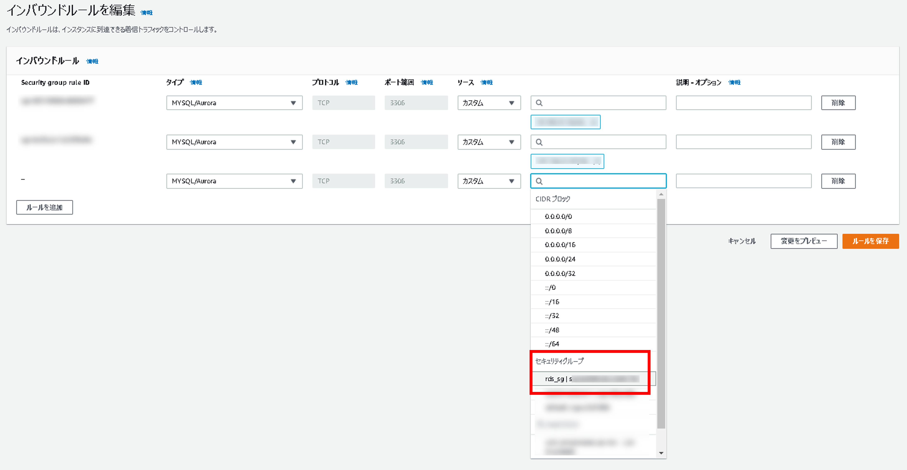
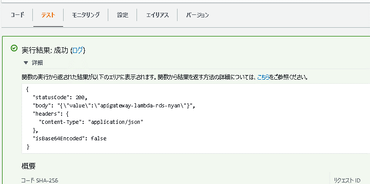
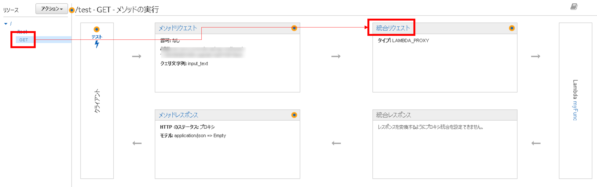
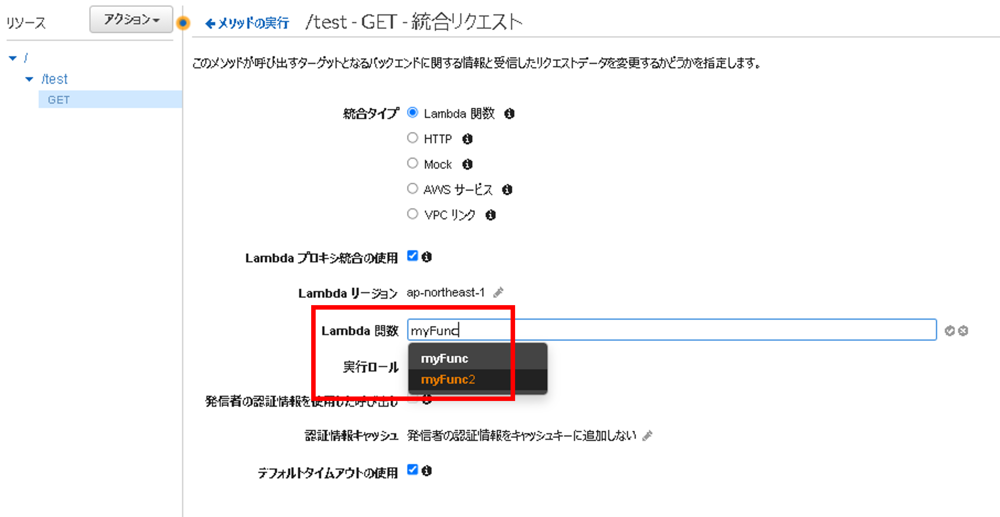
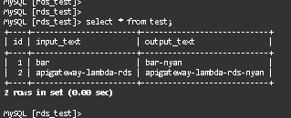
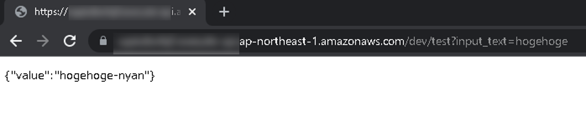
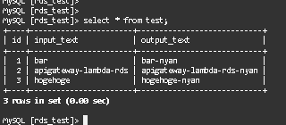

# Amazon RDS ハンズオン②  API Gateway と Lambda と RDS を組み合わせる

## Agenda

1. [Serverless アーキテクチャの概要](./01_serverless.md)
2. AWS Lambda の紹介とハンズオン
   1. [AWS Lambda の概要](./10_lambda.md)
   2. [AWS Lambda ハンズオン① Lambda を単体で使ってみる](./11_lambda_1.md)
   3. AWS Lambda ハンズオン② 他のサービスを呼び出してみる（実施しません）
3. Amazon API Gateway の紹介とハンズオン
   1. [Amazon API Gateway の概要](./20_apigateway.md)
   2. [Amazon API Gateway ハンズオン① API Gateway を単体で使ってみる](./21_apigateway_1.md)
   3. [Amazon API Gateway ハンズオン② API Gateway と Lambda を組み合わせる](./22_apigateway_2.md)
4. Amazon DynamoDB の紹介とハンズオン（実施しません）
   1. [Amazon DynamoDB の概要（実施しません）](./30_dynamodb.md)
5. Amazon RDS の紹介とハンズオン
   1. [Amazon RDSの概要](./40_rds.md)
   2. [Amazon RDS ハンズオン① RDSを単体で使ってみる](./41_rds_1.md)
   3. [Amazon RDS ハンズオン② API Gateway と Lambda と RDS を組み合わせる](./42_rds_2.md)
6. [終わりに](./99_end.md)


## 概要

先程作成したRDSと、LambdaやAPI Gatewayをつなげます。


### 手順（セキュリティグループの設定）

1. 「セキュリティグループ（VPCの機能）」を検索

2. セキュリティグループ名：`rds_sg`を選択

3. インバウンドルール→「編集（Edit inbound rules）」

4. インバウンドルール

   1. ルールを追加

   2. タイプ：`MYSQL/Aurora`

   3. リソースタイプ：カスタム

   4. ソース：セキュリティグループ（`rds_sg`）

      

   5. ルールを保存


### 手順（Lambdaの設定）

#### JDBCの設定、Jarの作成（ローカルPCにて実施）

1. JDBCの設定

   1. `aws_handson/01_serverless-architecture/3_rds-hands-on/src/main/java/org/example/handler/LambdaHandler.java`を修正する

      ```diff
      public class LambdaHandler implements RequestHandler<Map<String, Object>, Apigateway> {
      -    private static final String CONNECTION_STRING = "jdbc:mysql://<RDS-エンドポイント>:3306/rds_test";
      -    private static final String USERNAME = "admin";
      -    private static final String PASSWORD = "password";
      ```

      

2. jarの準備

   1. `aws_handson/01_serverless-architecture/3_rds-hands-on/`に移動

   2. `./gradlew shadowJar`を実行

      1. Windows（コマンドプロンプト）の場合は、「`.\gradlew.bat shadowJar`」

         ※依存ライブラリ（`jdbc`）もjarに含めるため（`fat jar`作成のため）に、`Gradle Shadow Plugin`を使用しています。


#### コードのアップロード（AWSマネジメントコンソールにて実施）

1. Lambdaを検索

2. 「関数の作成」を選択

   1. オプション：「一から作成」
   2. 関数名：任意（myFunc）

   3. ランタイム：Java8 on Amazon Linux 2

   4. アーキテクチャ：x86_64

   5. アクセス権限：デフォルト

3. 出力されたjarファイルを使用する

   1. 「コードタブ」＞「アップロード元」＞「zip または jar ファイル」

      

   2. 「アップロード」を選択し、先程作成したjarファイルを指定し、保存

      

   3. メソッドの指定

      1. 「コードタブ」＞「ランタイム設定」＞「編集」
         * ランタイム：Java 8 on Amazon Linux 2
         * ハンドラ：`org.example.handler.LambdaHandler::handleRequest`
         * アーキテクチャ：`x86_64`

   4. テスト実行

      1. 「テストタブ」＞「新しいイベント」

      2. 新しいイベント

      3. テンプレート：`apigateway-aws-proxy`

      4. 名前：test-api

      5. `queryStringParameters`を修正（7～9行目あたり）

         ```diff
           "queryStringParameters": {
         -    "foo": "bar"
         +    "input_text": "bar"
           },
         ```

      6. 変更を保存→テスト

         


### 手順（API Gatewayの設定）

1. API Gatewayを検索

2. `test-api`を選択

3. 「リソース」＞「GET」＞「統合リクエスト」

   

4. Lambda関数：`myFunc2`を選択し、チェック

   

5. 「Lambda関数に権限を追加する」→「OK」


### 手順（RDSの設定）

* 特に無し


## 動作確認

### CloudShell

* DBへアクセスする

  1. `mysql -u admin -p -h <RDS-エンドポイント> rds_test`

  2. 中身を確認する

     ```sql
     select * from test;
     ```

     ※Lambdaでテスト実行した値が入っているはず

     

### API Gateway

* デプロイしたURLへアクセスする

  * ```
    https://XXX.ap-northeast-1.amazonaws.com/dev/test?input_text=hogehoge
    ```

    ※`test?input_text=~~~`は忘れずに！

    

    


## Next

[＜ Amazon RDS ハンズオン① RDSを単体で使ってみる](./41_rds_1.md)

[終わりに ＞](./99_end.md)

