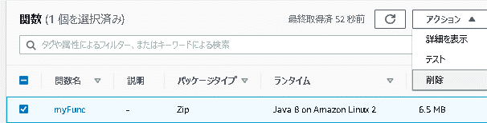
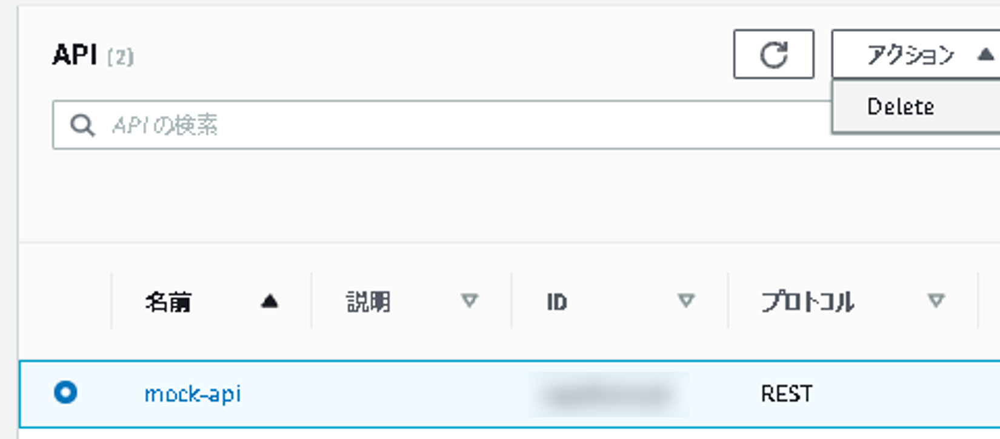
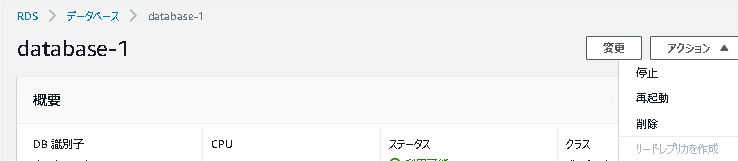

# おわりに

## Agenda

1. [Serverless アーキテクチャの概要](./01_serverless.md)
2. AWS Lambda の紹介とハンズオン
   1. [AWS Lambda の概要](./10_lambda.md)
   2. [AWS Lambda ハンズオン① Lambda を単体で使ってみる](./11_lambda_1.md)
   3. AWS Lambda ハンズオン② 他のサービスを呼び出してみる（実施しません）
3. Amazon API Gateway の紹介とハンズオン
   1. [Amazon API Gateway の概要](./20_apigateway.md)
   2. [Amazon API Gateway ハンズオン① API Gateway を単体で使ってみる](./21_apigateway_1.md)
   3. [Amazon API Gateway ハンズオン② API Gateway と Lambda を組み合わせる](./22_apigateway_2.md)
4. Amazon DynamoDB の紹介とハンズオン（実施しません）
   1. [Amazon DynamoDB の概要（実施しません）](./30_dynamodb.md)
5. Amazon RDS の紹介とハンズオン
   1. [Amazon RDSの概要](./40_rds.md)
   2. [Amazon RDS ハンズオン① RDSを単体で使ってみる](./41_rds_1.md)
   3. [Amazon RDS ハンズオン② API Gateway と Lambda と RDS を組み合わせる](./42_rds_2.md)
6. [終わりに](./99_end.md)

## 落ち穂拾い：環境の削除・停止

* Lambda

  * 削除したい関数を選択し、「アクション」＞「削除」

    

* API Gateway

  * 削除したい名前を選択し、「アクション」＞「delete」

    

* RDS

  * 削除したいインスタンスを選択し、「アクション」＞「削除」

    

## 落ち穂拾い：例外処理など

* 今回作成したソースコードでは例外処理を実装していません。
  * 実際の開発時は、例外ハンドリングを適切に行なってください。
* DBへの接続情報を切り出していません。
  * `application.properties`等に切り出して使用してください。

## まとめ

* サーバレスの特徴や利点について学びました。
* AWS Lambda、Amazon API Gateway、Amazon RDSといったAWSサービスの基礎知識を学びました。
* 実際に手を動かして、サーバレスアーキテクチャでWebAPIを作成しました。

## 今後

* 深く学ぶ
  * サーバレスアーキテクチャで、なにかプロダクトを作成する
    * チャットボット、オリジナルWebAPI・・・
  * DynamoDBなど、他のサーバレスアーキテクチャでよく使われるAWSのサービスを使用してみる
  * SpringBootなど、AWSサービス以外の部分をサーバレスアーキテクチャに準拠させてみる
  * 運用してみる
  * 画面（GUI）を作成して、そこから叩いてみる
* 広く学ぶ
  * AWSのハンズオンを受講してみる
  * 資格取得のための学習をする

## Next

[＜ Amazon RDS ハンズオン② API Gateway と Lambda と RDS を組み合わせる](./42_rds_2.md)

[README ＞](./README.md)

