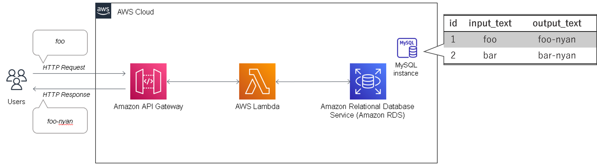
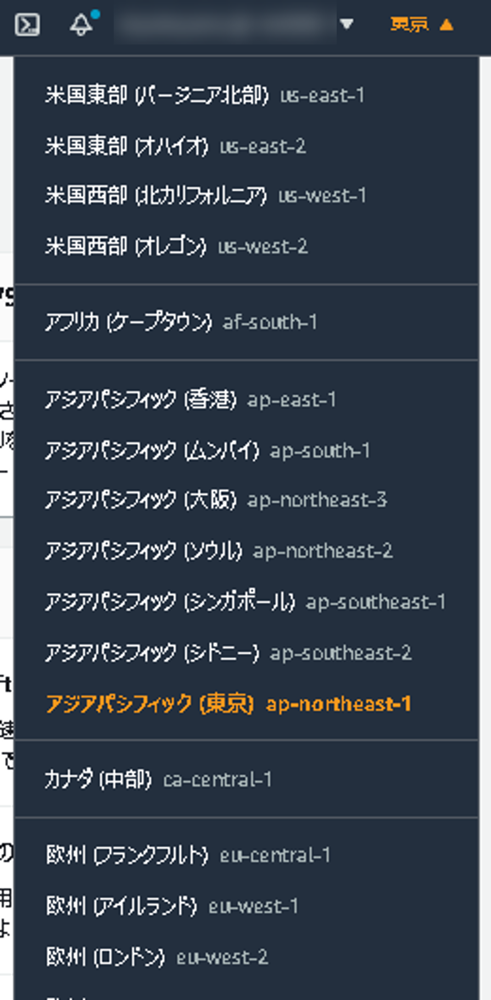
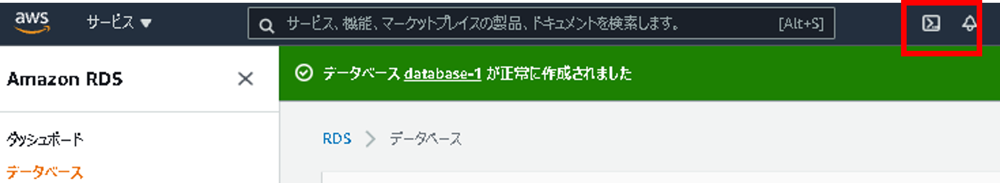

# サーバレスアーキテクチャ

## はじめに

本資料は、AWSが提供している学習コンテンツ「AWS Hands-on for Beginners」より、「[AWS Hands-on for Beginners
Serverless #1サーバーレスアーキテクチャで翻訳 Web API を構築する](https://pages.awscloud.com/event_JAPAN_Hands-on-for-Beginners-Serverless-2019_LP.html?trk=aws_introduction_page)」を参考に記載しています。

## 本ハンズオンのゴール

> • AWS Lambda, Amazon API Gateway, Amazon DynamoDB の基本を学ぶ
>
> • 上記のサービスを組み合わせて、サーバーレスな Web API を作成する

→DynamoDBの代わりに、馴染みのある「Amazon RDS」を使用します。



### 【補足】サーバレスとRDSの組み合わせについて

基本的に、サーバレスとRDSの組み合わせは**アンチパターン**です。

詳細については解説しませんが、Lambdaはリクエスト毎にコンテナを作成（1リクエスト毎に1コンテナを作成して1イベントのみ処理）し、そのコンテナ毎にDBコネクションを張ります。コンテナ間でコネクションプーリングを共有するのは困難であり、最大同時接続数の問題が発生します。

「[Amazon RDS Proxy](https://pages.awscloud.com/rs/112-TZM-766/images/EV_amazon-rds-aws-lambda-update_Jul28-2020_RDS_Proxy.pdf)（言うなれば、Lambda用のコネクションプーリングサービス）」がリリースされた事により、当アンチパターンは解消・解決となりますが、コスト面等の考慮が必要なため「完全解決」には至っていません。

なお、本ハンズオンでは「RDS Proxy」は使用しません。


## 本ハンズオンの前提条件・知識

> • AWS アカウントをお持ちであること
>
> • Java を書いたことがあること（必須ではありません）

→「AWS Hands-on for Beginners」ではPythonを使用していますが、Javaに書き換えています


## Agenda

1. [Serverless アーキテクチャの概要](./01_serverless.md)
2. AWS Lambda の紹介とハンズオン
   1. [AWS Lambda の概要](./10_lambda.md)
   2. [AWS Lambda ハンズオン① Lambda を単体で使ってみる](./11_lambda_1.md)
   3. AWS Lambda ハンズオン② 他のサービスを呼び出してみる（実施しません）
3. Amazon API Gateway の紹介とハンズオン
   1. [Amazon API Gateway の概要](./20_apigateway.md)
   2. [Amazon API Gateway ハンズオン① API Gateway を単体で使ってみる](./21_apigateway_1.md)
   3. [Amazon API Gateway ハンズオン② API Gateway と Lambda を組み合わせる](./22_apigateway_2.md)
4. Amazon DynamoDB の紹介とハンズオン（実施しません）
   1. [Amazon DynamoDB の概要（実施しません）](./30_dynamodb.md)
5. Amazon RDS の紹介とハンズオン
   1. [Amazon RDSの概要](./40_rds.md)
   2. [Amazon RDS ハンズオン① RDSを単体で使ってみる](./41_rds_1.md)
   3. [Amazon RDS ハンズオン② API Gateway と Lambda と RDS を組み合わせる](./42_rds_2.md)
6. [終わりに](./99_end.md)


## 事前準備

* CloudShell環境に、本リポジトリのダウンロードとJDK1.8（Corret）をインストールします。


### 注意事項

* 本ハンズオンは、全サービスを「東京リージョン（ap-northeast-1）」での動作と想定しています。

  * 異なるリージョンを使用の際は、東京リージョンへの変更をお願いします。

    


### 手順

1. CloudShellを開く

   ※起動まで数分かかります

   

2. 下記コマンドを実行する

   ```bash
   // download git repositry
   git clone https://github.com/nobkovskii/aws_handson.git
   
   // download and set JDK1.8(corret8)
   sudo amazon-linux-extras enable corretto8
   sudo yum install -y java-1.8.0-amazon-corretto-devel
   
   // check jdk
   java -version
   
   ```

   

## Next

[Serverless アーキテクチャの概要 ＞](./01_serverless.md)

