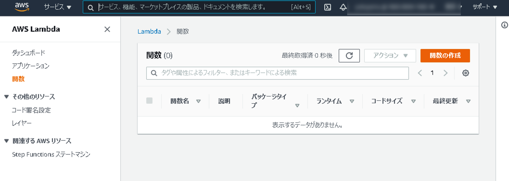

# サーバレスアーキテクチャ

## はじめに

本資料は、AWSが提供している学習コンテンツ「AWS Hands-on for Beginners」より、「[AWS Hands-on for Beginners
Serverless #1サーバーレスアーキテクチャで翻訳 Web API を構築する](https://pages.awscloud.com/event_JAPAN_Hands-on-for-Beginners-Serverless-2019_LP.html?trk=aws_introduction_page)」を参考に記載しています。

## 本ハンズオンのゴール

> • AWS Lambda, Amazon API Gateway, Amazon DynamoDB の基本を学ぶ
>
> • 上記のサービスを組み合わせて、サーバーレスな Web API を作成する

→DynamoDBの代わりに、馴染みのある「Amazon RDS」を使用します。

### 【補足】サーバレスとRDSの組み合わせについて

基本的に、サーバレスとRDSの組み合わせは**アンチパターン**です。

詳細については解説しませんが、Lambdaはリクエスト毎にコンテナを作成（1リクエスト毎に1コンテナを作成して1イベントのみ処理）し、そのコンテナ毎にDBコネクションを張ります。コンテナ間でコネクションプーリングを共有するのは困難であり、最大同時接続数の問題が発生します。

「RDS Proxy（言うなれば、Lambda用のコネクションプーリングサービス）」がリリースされた事により、当アンチパターンは解消・解決となりますが、コスト面等の考慮が必要なため「完全解決」には至っていません。

なお、本ハンズオンでは「RDS Proxy」は使用しません。


## 本ハンズオンの前提条件・知識

> • AWS アカウントをお持ちであること
>
> • Java を書いたことがあること（必須ではありません）

→「AWS Hands-on for Beginners」ではPythonを使用していますが、Javaに書き換えています


## Agenda

1. Serverless アーキテクチャの概要
2. AWS Lambda の紹介とハンズオン
   1. AWS Lambda の概要
   2. AWS Lambda ハンズオン① Lambda を単体で使ってみる
   3. AWS Lambda ハンズオン② 他のサービスを呼び出してみる（実施しません）
3. Amazon API Gateway の紹介とハンズオン
   1. Amazon API Gateway の概要
   2. Amazon API Gateway ハンズオン① API Gateway を単体で使ってみる
   3. Amazon API Gateway ハンズオン② API Gateway と Lambda を組み合わせる
4. Amazon DynamoDB の紹介とハンズオン（実施しません）
   1. Amazon DynamoDB の概要（実施しません）
5. Amazon RDSの紹介とハンズオン
   1. Amazon RDSの概要
   2. Amazon RDS ハンズオン① RDSを単体で使ってみる
   3. Amazon RDS ハンズオン②  API Gateway と Lambda と RDS を組み合わせる


# 1.Serverless アーキテクチャの概要

### なぜサーバレスアーキテクチャなのか？

開発者は何をしたいのか？
→エンドユーザに価値を届ける

ビジネスには繋がらない（エンドユーザには見えない）が、必要な作業がある。

* サーバのセットアップ
* ミドルウェアランタイムのセットアップ
* セキュリティパッチの適用
* 耐障害性を確保するためのアーキテクチャ検討

サーバレスアーキテクチャは、これらの作業を**マネージドサービスに任せる**という特徴がある。

サーバレスアーキテクチャの主な特徴

* インフラのプロビジョニングや管理が不要
* 自動でスケール[^1]
* 高い可用性[^1]
* 価値に対する支払い[^2]


### AWSにおけるComputeサービス


大きく分けると3種類

* EC2
* Container
* Lambda

優劣があるわけではなく、適材適所、ないしは開発・運用する人のスキルセットに応じて、使い分けることが重要。

* 自由度
* 管理の手間


### サーバレスアーキテクチャでよく使われるAWSのサービス


computeサービス以外にも、よく使用されるサービスがある。


# 2.AWS Lambda の紹介とハンズオン

## AWS Lambda の概要

### AWS Lambda の特徴

> * サーバーのプロビジョニング/管理なしでプログラムを実⾏できるサービス 
> * コードの実⾏やスケーリングに必要なことは、Lambda 側で実施するので、 開発者の⽅はコードを書くことにより集中できる
> * リクエストベースの料⾦体系
>   * 実行回数＋実行時間
>     * それぞれ無料枠有り

### AWS Lambda におけるコーディングイメージ

* 対応言語
  * Java、Go、PowerShell、Node.js、C#、Python、Ruby
  * サポートされていない言語は、カスタムランタイムを実装することで利用可能

### AWS Lambda で設定できる項⽬ 

* 確保するメモリの量
  * 128MB 〜 3,008MB （64MBごと）
  * CPU 能⼒は確保するメモリの量に⽐例
* タイムアウト値
  * 最⼤で 900秒
* 実⾏ IAM ロール

### Lambdaのイベントソースと呼び出しタイプ

* 非同期呼び出し
  * 「Lambdaへのリクエストが正常に受け付けられたかどうかのみ」を返却
* 同期呼び出し
  * Lambdaの実行完了時にレスポンスを返却

### Lambda Functionのライフサイクル

* Lambdaは呼び出されると、コンテナ上でプログラムが実行する
* 1つのコンテナで同時に実行できるのは、1つのリクエストまで
* コンテナは再利用されるが、利用可能なコンテナが無い時はコールドスタート


## AWS Lambda ハンズオン① Lambda を単体で使ってみる

1. Lambdaを検索

   

2. 「関数の作成」を選択

3. 「関数の作成」

   1. 関数名：任意（myFunc）
   2. ランタイム：Java8 on Amazon Linux 1
   3. アクセス権限：デフォルト

   

4. 作成後

   
   
5. jarのアップロード

   [ソースコード](./1_lambda-hands-on/)

   1. ソースコードを任意の箇所にダウンロード

   2. ダウンロードしたディレクトリに移動して、`./gradlew build`

      1. Windows（コマンドプロンプト）の場合は「`.\gradlew.bat build`」

         ※すでにファイルがある場合は、上書きされない可能性があるので、削除してから行う

   3. `build/libs/HandsOn-1.0-SNAPSHOT.jar`が出力される

   4. 出力されたjarファイルを使用する

   

6. メソッドの指定

   * ランタイム：Java 8 on Amazon Linux 1
   * ハンドラ：`org.example.LambdaHandler::handleRequest`

   

   

7. テスト実行

   

   


# 3.Amazon API Gateway の紹介とハンズオン

## Amazon API Gateway の概要

### API Gatewayの特徴

> * サーバをプロビジョニング／管理することなく、APIの作成・管理出来るマネージドサービス。
> * 可用性の担保やスケーラビリティの確保、APIキーの管理と言った作業を、API Gatewayに任せる事ができ、開発者はAPIの開発に注力することが可能。
> * 「REST API」と「WebSocket」に対応
>   * 本ハンズオンでは「REST API」を使用
>   * リクエストベースの料金体系
>     * 実行回数（＋キャッシュメモリ量）＋データ転送量


### API Gatewayの使い方（REST APIの場合）

大きく5つのフェーズに分かれる。

1. リソースとメソッドタイプの定義
2. メソッドリクエストの設定
   * 認証の設定、クエリパラメータ、HTTPヘッダの設定など
3. 統合タイプの設定
   * バックエンドの種別を選択する
     * Lambda、HTTP、Mock、AWSサービス、VPCリンク
4. リクエスト／レスポンス変換の定義
   * バックエンドへのInput、バックエンドからのOutputを変換することが可能
   * 「プロキシ統合」を使用すると、変換せずに返すことが可能
5. デプロイ


## Amazon API Gateway ハンズオン① API Gateway を単体で使ってみる

### Mockデータを返すAPIを作成する

1. API Gatewayを検索

2. 「今すぐ始める」を選択

3. APIの作成

   1. プロトコル：REST
   2. 新しいAPIの作成：新しいAPI
   3. 名前と説明
      1. API名：mock-api
      2. 説明：空欄
      3. エンドポイントタイプ：リージョン

4. 「アクション」→「リソースの作成」を選択

   1. リソース名：sample

5. 作成した「sample」を選択した状態で、「アクション」→「メソッドの作成」を選択

   1. プルダウン：GET
   2. チェックボタンを押下

6. セットアップ

   1. 統合タイプ：Mock

7. 統合レスポンスを選択

   1. マッピングテンプレート：`application/json`

   2. json内容

      ```json
      {
          "statusCode":200,
          "body":"hoge"
      }
      ```

8. 「メソッドの実行」→「テスト」→「テスト」を実行

9. デプロイ

   1. 「アクション」→「APIのデプロイ」
      1. デプロイされるステージ：新しいステージ
      2. ステージ名：dev

10. 「ステージ」→「dev」→「URLの呼び出し」を選択


## Amazon API Gateway ハンズオン② API Gateway と Lambda を組み合わせる

### 入力した文字列の末尾に「`-nyan`」とつけるAPIを作成する:cat:

※「この程度ならLambdaいらないじゃん」とか言わないで・・・

[ソースコード](./2_apigateway-hands-on/)

* 依存ライブラリ（`Gson`）もjarに含めるため（`fat jar`作成のため）に、`Gradle Shadow Plugin`を使用しています。

  * `./gradlew shadowJar`を実行することで、`fat jar`が作成されます。

    ※Windowsの場合は、同様に`.\gradlew.bat shadowJar`を実行してください

1. Lambdaを検索
2. 先程作成した「myFunc」を使用する
3. jarのアップロード
   1. 上記で作成した`fat jar`を指定する
4. テスト
   1. 新しいイベント
   2. テンプレート：`apigateway-aws-proxy`
   3. 名前：test-api
   4. 変更を保存→テスト


### API Gatewayの設定

1. API Gatewayを検索

2. 「今すぐ始める」を選択

3. APIの作成

   1. プロトコル：REST
   2. 新しいAPIの作成：新しいAPI
   3. 名前と説明
      1. API名：test-api
      2. 説明：空欄
      3. エンドポイントタイプ：リージョン

4. 「アクション」→「リソースの作成」を選択

   1. リソース名：test

5. 作成した「test」を選択した状態で、「アクション」→「メソッドの作成」を選択

   1. プルダウン：GET
   2. チェックボタンを押下

6. セットアップ

   1. 統合タイプ：Lambda 関数
   2. Lambda プロキシ統合の使用：チェックを入れる
   3. Lambda関数：myFunc
   4. Lambda関数に権限を追加する：OK

7. メソッドリクエストを選択

   1. URLクエリ文字列パラメータ

      1. 名前：`input_text`

      2. 必須：チェックを入れる

         ※一度作成しないとチェックを行えない

8. 「メソッドの実行」→「テスト」→「テスト」を実行

   1. クエリ文字列

      `input_text=hoge`

9. デプロイ

   1. 「アクション」→「APIのデプロイ」
      1. デプロイされるステージ：dev

10. 「ステージ」→「dev」→「URLの呼び出し」を選択

    1. URLの末尾に`/test?input_text=bar`を追加


# 4.Amazon DynamoDB の紹介とハンズオン（実施しません）


# 5.Amazon RDSの紹介とハンズオン


[^1]: オンプレやEC2だと、どのような条件でスケールするのかを検討・設計する必要があるが、サーバレスのサービスでその一部を担保出来る。
[^2]: オンプレの場合はサーバを起動しているだけで費用がかかるが、サーバレスならリクエスト毎に課金。

